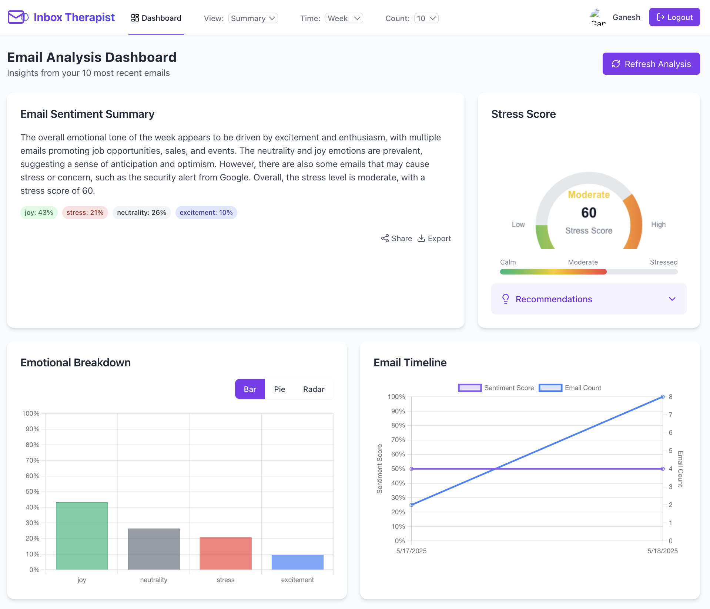

# Inbox Therapist



## 📋 Overview

Inbox Therapist is an AI-powered Gmail mental health analyzer that helps users understand the emotional impact of their email communications. By connecting to a user's Gmail account, the application analyzes recent emails for sentiment patterns, stress levels, and emotional content, then presents the findings through an intuitive dashboard with visualizations and personalized recommendations.

## 🎯 Purpose

Email overload and digital communication stress are significant contributors to workplace anxiety and burnout. Inbox Therapist aims to:

- Help users become aware of their email-related stress levels
- Identify emotional patterns in communication
- Provide actionable recommendations to improve digital wellbeing
- Visualize communication health through intuitive charts and metrics

## ✨ Key Features

- **Gmail OAuth Integration**: Secure access to user's email with proper permissions
- **AI-Powered Sentiment Analysis**: Analyzes email content for emotional tone using Groq LLM
- **Comprehensive Dashboard**: Visual representation of email sentiment data
- **Multiple Visualization Options**: Bar, pie, and radar charts for emotional breakdown
- **Email Timeline**: Track sentiment changes over time
- **Stress Score Gauge**: Visual indicator of overall email-related stress
- **Personalized Recommendations**: Tailored suggestions based on dominant emotions
- **Detailed Email Analysis**: Individual sentiment analysis for each email
- **Flexible View Modes**: Summary, detailed, and table views
- **Time Range Filtering**: Analyze emails from the past week, month, or all time
- **Export and Share**: Share analysis results or export as JSON

## Technical Architecture

### System Architecture

```
┌─────────────────┐     ┌─────────────────┐     ┌─────────────────┐
│                 │     │                 │     │                 │
│  React Frontend │◄────┤  Express Server │◄────┤   Gmail API     │
│                 │     │                 │     │                 │
└────────┬────────┘     └────────┬────────┘     └─────────────────┘
         │                       │
         │                       │
         │               ┌───────▼───────┐
         │               │               │
         └──────────────►│    Groq LLM   │
                         │               │
                         └───────────────┘
```

### Data Flow

1. User authenticates with Google OAuth
2. Server requests access to Gmail data
3. Server fetches recent emails from Gmail API
4. Email data is sent to Groq LLM for sentiment analysis
5. Analysis results are processed and formatted
6. Frontend displays the analysis through various visualizations

## 💻 Technologies Used

### Frontend
- **React.js**: UI library for building the user interface
- **React Router**: For navigation and routing
- **Chart.js & react-chartjs-2**: For data visualization
- **Tailwind CSS**: For styling and responsive design
- **Lucide React**: For icons and visual elements

### Backend
- **Node.js**: JavaScript runtime environment
- **Express.js**: Web application framework
- **Google APIs**: For Gmail access and OAuth authentication
- **Groq SDK**: For AI-powered sentiment analysis
- **dotenv**: For environment variable management
- **CORS**: For cross-origin resource sharing

## 🚀 Setup Instructions

### Prerequisites
- Node.js (v14 or higher)
- npm or yarn
- Google Cloud Platform account
- Groq API account

### Environment Variables

Create a `.env` file in the server directory with the following variables:

```
GOOGLE_CLIENT_ID=your_google_client_id
GOOGLE_CLIENT_SECRET=your_google_client_secret
REDIRECT_URI=https://inbox-therapist.onrender.com/auth/google/callback
FRONTEND_URI=https://inbox-therapist.vercel.app
GROQ_API_KEY=your_groq_api_key
PORT=5050
```

### Google OAuth Setup

1. Go to the [Google Cloud Console](https://console.cloud.google.com/)
2. Create a new project
3. Enable the Gmail API
4. Configure the OAuth consent screen
5. Create OAuth credentials (Web application)
6. Add authorized redirect URIs:
   - `http://localhost:5050/auth/google/callback`
7. Add authorized JavaScript origins:
   - `http://localhost:3000`
8. Copy the Client ID and Client Secret to your `.env` file

### Groq API Setup

1. Sign up for a Groq account at [console.groq.com](https://console.groq.com)
2. Generate an API key
3. Copy the API key to your `.env` file

### Installation

#### Backend Setup
```bash
# Clone the repository
git clone https://github.com/ganesh-7985/inbox-therapist
cd inbox-therapist

# Install server dependencies
cd server
npm install

# Start the server
npm start